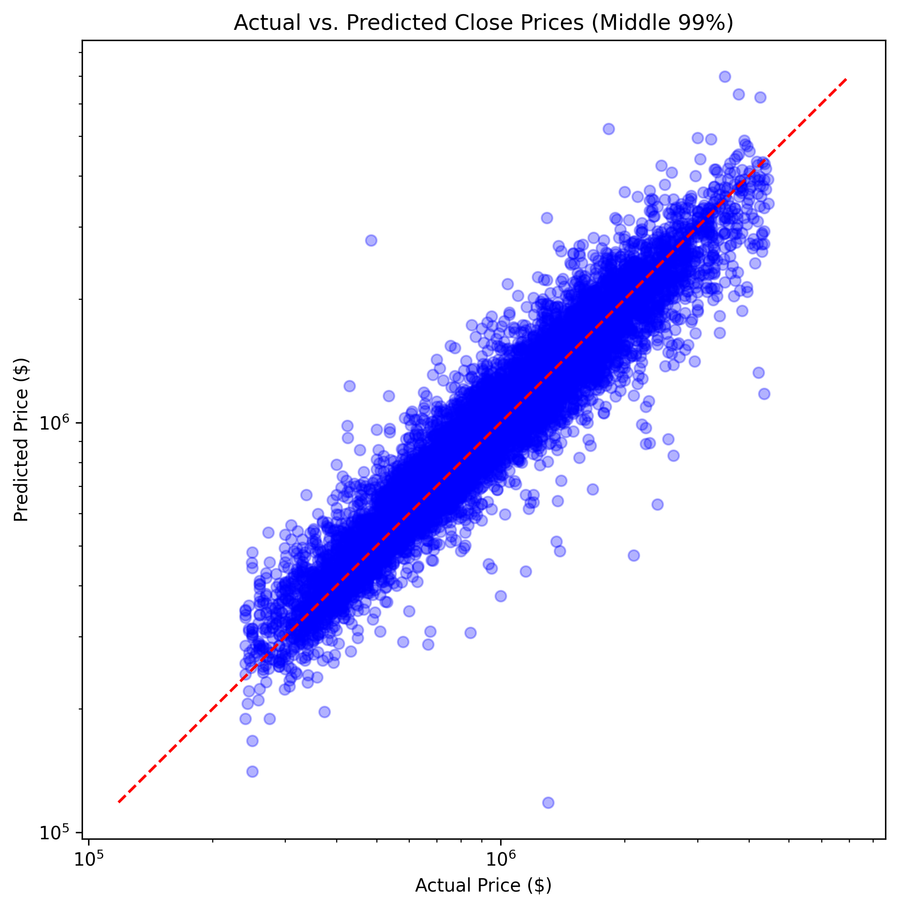
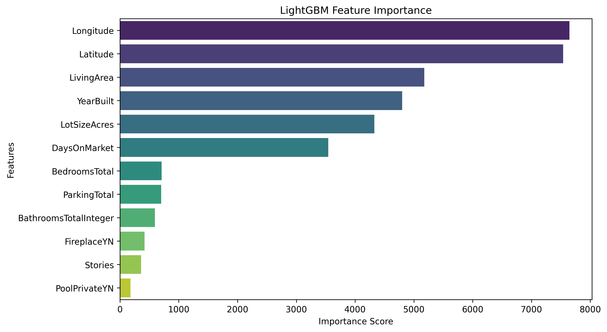

## California Real Estate Price Prediction (Regression)
* **Context:** Professional Experience (Internship at IDX Exchange)
* **Tools:** Python, LightGBM, Scikit-Learn, Pandas
* **Key Techniques:** Automated Valuation Modeling (AVM), Gradient Boosting, Outlier Detection

### Project Objective
Developed a machine learning model to predict the close price of single-family residences in California using 10 months of proprietary transaction data from the California Regional Multiple Listing Service (CRMLS).

### Technical Implementation
* **Preprocessing:** Aggregated and cleaned over 170,000 raw transaction records, implementing rigorous filtering for property subtypes and handling missing values via mode/median imputation strategies.
* **Feature Engineering:** Applied Interquartile Range (IQR) methods to remove physical anomalies (e.g., negative lot sizes) and log-transformed the target variable to normalize price distribution.
* **Modeling:** Trained and optimized a **Light Gradient Boosting Machine (LGBMRegressor)** using 5-fold Grid Search Cross-Validation to capture non-linear market dynamics.

### Performance
* Achieved a Median Absolute Percentage Error (**MdAPE**) of **7.7%** on the middle 99% of test data, reducing the error rate by **67%** compared to the linear regression baseline (23.6%).
* Reached an **R² of 0.87**, demonstrating high predictive power for real-world property valuation.

### Visual Performance

 
