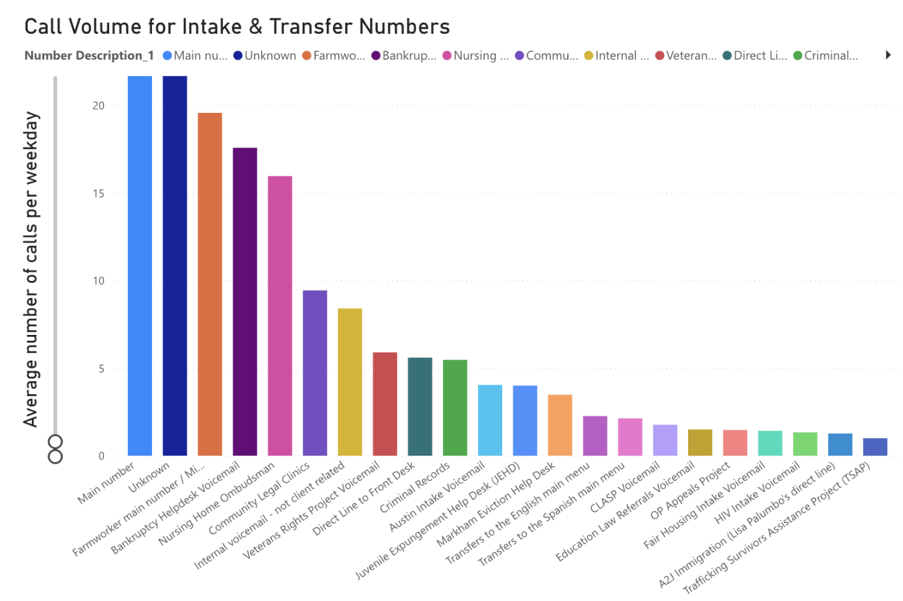

### 3. [LegalAid Call Flow Visualization](./legalaid-dashboard)
* **Context:** Coursework (Social Impact)
* **Objective:** Designed an interactive Power BI dashboard to visualize call center data for LegalAid, an organization providing legal services for low-income and vulnerable residents in Chicago. Implemented **drill-down features** to track call flows, identifying specific bottlenecks in client service and resource allocation.
* **Key Techniques:** Data Modeling (DAX), Interactive Dashboarding, Drill-through Analysis.
* **Tools:** Microsoft Power BI.
* **Note on Data Privacy:** *Due to the sensitive nature of legal client data, the raw `.pbix` file and datasets are not included in this repository. Below are static demonstrations of the dashboard's functionality and logic.*

## 📸 Dashboard Demo
`

### Feature Highlight: Call Flow Drill-Down
To solve the issue of unexplained dropped calls, I built a hierarchy that allows users to drill down from:
1.  **Overview:** Total Call Volume by Region.
2.  **Drill-Down:** Specific Call Types (Housing, Family Law, etc.).
3.  **Leaf Level:** Outcome Status (Resolved, Dropped, Voicemail).

`