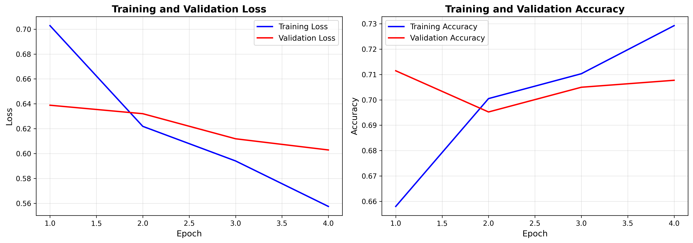

## Pneumonia Detection from Chest X-Rays (Computer Vision)
* **Context:** Academic Project (Coursework - STAT 362)
* **Tools:** Python, PyTorch, DenseNet121, Pandas, Scikit-Learn
* **Key Techniques:** Convolutional Neural Networks (CNN), Transfer Learning, Class Weighting, Data Augmentation

### Project Objective
Built a deep learning classification pipeline to categorize chest X-rays into three clinically distinct classes: **Normal**, **Pneumonia (Lung Opacity)**, and **Other Pathology**. The goal was to automate the screening process and reduce diagnostic time for lung conditions.

### Technical Implementation
* **Data Processing:** Processed the **RSNA Pneumonia Detection Challenge** dataset (26,684 unique DICOM images). Implemented a custom PyTorch `Dataset` class to handle DICOM loading and applied **intense data augmentation** (rotation ±15°, zoom ±10%, horizontal flip) to address class imbalance and overfitting.
* **Model Architecture:** Utilized a pre-trained **DenseNet121** (ImageNet weights) as the backbone for feature extraction. Replaced the classifier head with a custom fully connected block (`Linear` → `ReLU` → `Dropout(0.4)` → `Linear`) to map features to the 3 target classes.
* **Optimization:** Trained with **Cross-Entropy Loss** weighted by class inverse frequency to penalize misclassifying the minority "Pneumonia" class. Used the **AdamW** optimizer with a `ReduceLROnPlateau` scheduler.

### Performance
* **Test Accuracy:** 73.3% (Multi-class), significantly outperforming the baseline CNN accuracy of 52.7%.
* **Clinical Relevance:** Achieved a **Binary Accuracy of 88.5%** and a **Recall of 86.7%** when distinguishing "Sick" (Pneumonia + Other) from "Healthy" patients, demonstrating high utility as a first-line triage tool.
* **Robustness:** The ROC curves confirm strong separability, with Class 0 (Normal) achieving an **AUC of 0.94** and Class 1 (Pneumonia) an **AUC of 0.88**.

### Visual Performance

  
  

